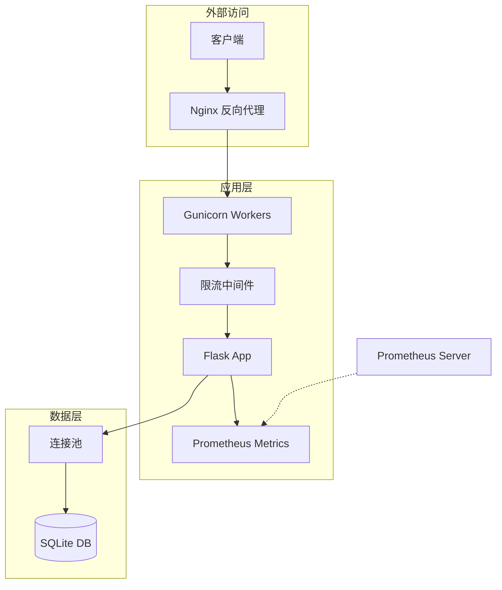

# Design Document

## Overview

本设计文档描述将 Edge TTS Web Interface 提升到生产就绪状态的技术实现方案。涵盖安全加固、测试修复、限流、监控、部署配置和数据库优化六个方面。

## Architecture



## Components and Interfaces

### 1. 安全配置模块 (src/config.py)

```python
class SecurityConfig:
    """安全配置验证"""
    
    @staticmethod
    def validate_secret_key(key: str) -> str:
        """验证并返回安全的 SECRET_KEY"""
        pass
    
    @staticmethod
    def check_admin_password() -> None:
        """检查管理员密码安全性"""
        pass
```

### 2. 限流中间件 (src/utils/rate_limiter.py)

```python
class RateLimiter:
    """IP 级别请求限流"""
    
    def __init__(self, requests_per_minute: int = 100):
        pass
    
    def is_allowed(self, ip: str) -> bool:
        """检查 IP 是否允许请求"""
        pass
    
    def get_retry_after(self, ip: str) -> int:
        """获取重试等待时间（秒）"""
        pass
```

### 3. Prometheus 指标 (src/utils/metrics.py)

```python
class MetricsCollector:
    """Prometheus 指标收集器"""
    
    request_count: Counter      # 请求计数
    request_latency: Histogram  # 请求延迟
    active_connections: Gauge   # 活跃连接数
    service_status: Gauge       # 服务状态
```

### 4. 数据库连接池 (src/utils/db_pool.py)

```python
class ConnectionPool:
    """SQLite 连接池"""
    
    def __init__(self, db_path: str, pool_size: int = 5):
        pass
    
    def get_connection(self) -> Connection:
        """获取连接（阻塞等待）"""
        pass
    
    def release_connection(self, conn: Connection) -> None:
        """释放连接回池"""
        pass
```

## Data Models

### 限流记录（内存存储）

```python
@dataclass
class RateLimitRecord:
    ip: str
    request_count: int
    window_start: float  # Unix timestamp
    blocked_until: Optional[float] = None
```

### Prometheus 指标标签

```python
METRIC_LABELS = {
    "request_count": ["method", "endpoint", "status"],
    "request_latency": ["method", "endpoint"],
    "service_status": ["service_name"],  # asr, tts, ai
}
```

## Correctness Properties

*A property is a characteristic or behavior that should hold true across all valid executions of a system-essentially, a formal statement about what the system should do. Properties serve as the bridge between human-readable specifications and machine-verifiable correctness guarantees.*

### Property 1: 敏感信息掩码
*For any* sensitive configuration value (API keys, passwords, secrets) that appears in logs, the value should be masked with asterisks or truncated
**Validates: Requirements 1.3**

### Property 2: SECRET_KEY 长度验证
*For any* SECRET_KEY string with length less than 32 characters, the system should reject it and raise ConfigError
**Validates: Requirements 1.4**

### Property 3: 限流阈值执行
*For any* IP address making more than the configured limit of requests within a minute window, all requests exceeding the limit should receive HTTP 429
**Validates: Requirements 3.1**

### Property 4: 限流窗口重置
*For any* IP address that was rate-limited, after the window expires (1 minute), subsequent requests should be allowed
**Validates: Requirements 3.4**

### Property 5: 请求计数准确性
*For any* HTTP request to the application, the Prometheus request_count metric should increment by exactly 1 with correct method, endpoint, and status labels
**Validates: Requirements 4.2**

### Property 6: 健康检查状态转换
*For any* sequence of 3 consecutive health check failures, the system health status should transition to unhealthy
**Validates: Requirements 5.4**

### Property 7: 连接池大小限制
*For any* number of concurrent database requests, the number of active connections should never exceed the configured pool_size
**Validates: Requirements 6.1**

### Property 8: 连接归还一致性
*For any* database operation that completes (success or failure), the connection should be returned to the pool
**Validates: Requirements 6.3**

### Property 9: 连接池队列行为
*For any* concurrent request count exceeding pool_size, requests should queue and eventually succeed rather than immediately fail
**Validates: Requirements 6.4**

## Error Handling

| 场景 | 处理方式 | HTTP 状态码 |
|------|----------|-------------|
| SECRET_KEY 无效 | 启动失败，抛出 ConfigError | N/A |
| 限流触发 | 返回 429 + Retry-After 头 | 429 |
| 数据库连接超时 | 重试 3 次后返回 503 | 503 |
| 指标收集失败 | 记录日志，不影响主流程 | N/A |

## Testing Strategy

### 单元测试
- 安全配置验证逻辑
- 限流算法（滑动窗口）
- 连接池获取/释放

### 集成测试
- 限流中间件与 Flask 集成
- Prometheus 指标端点
- 数据库连接池在并发下的行为

### 属性测试 (Property-Based Testing)
使用 **Hypothesis** 库进行属性测试：
- 限流窗口边界条件
- 连接池并发安全性

### 测试配置
- 每个属性测试运行 100 次迭代
- 测试注释格式: `**Feature: production-readiness, Property {number}: {property_text}**`
